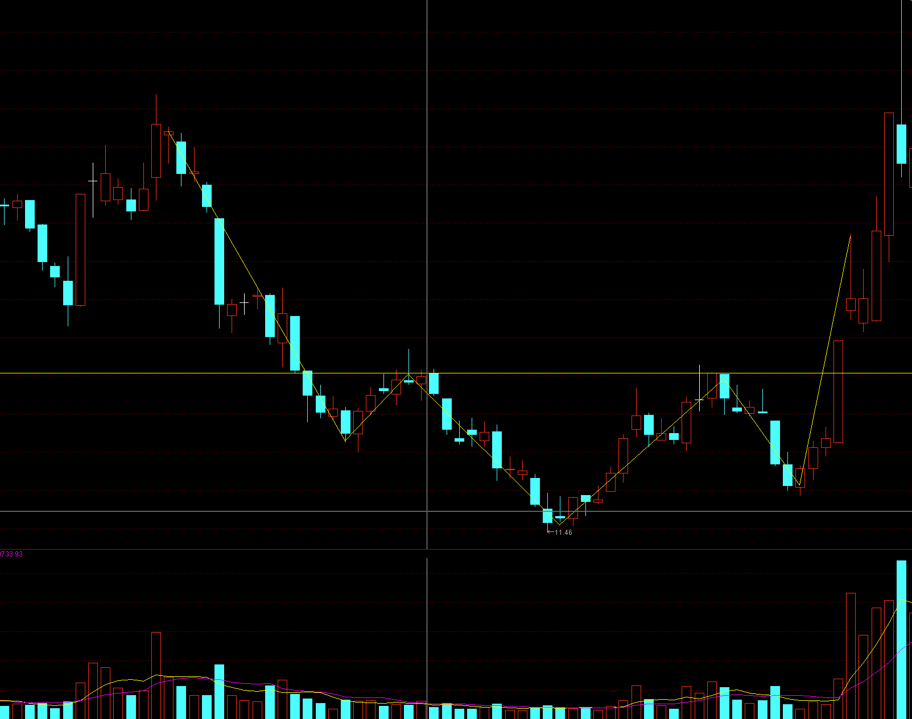
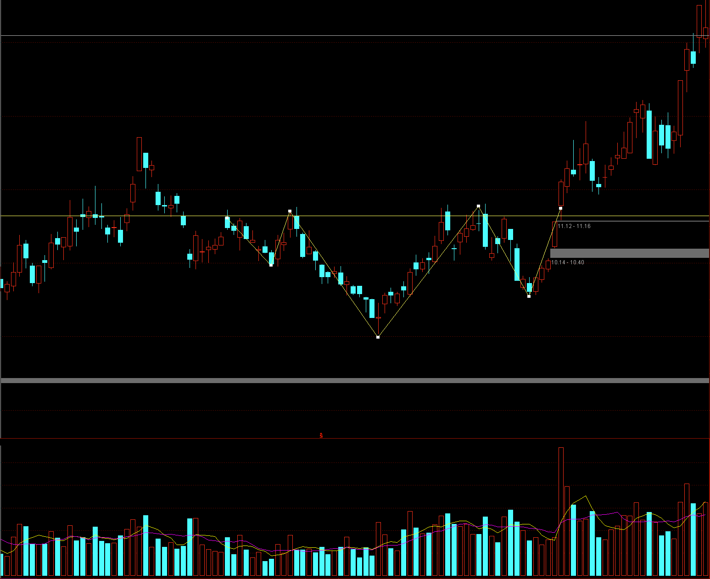
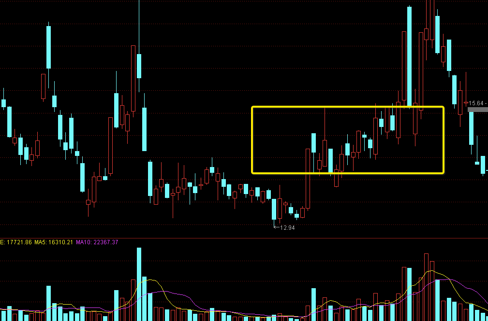
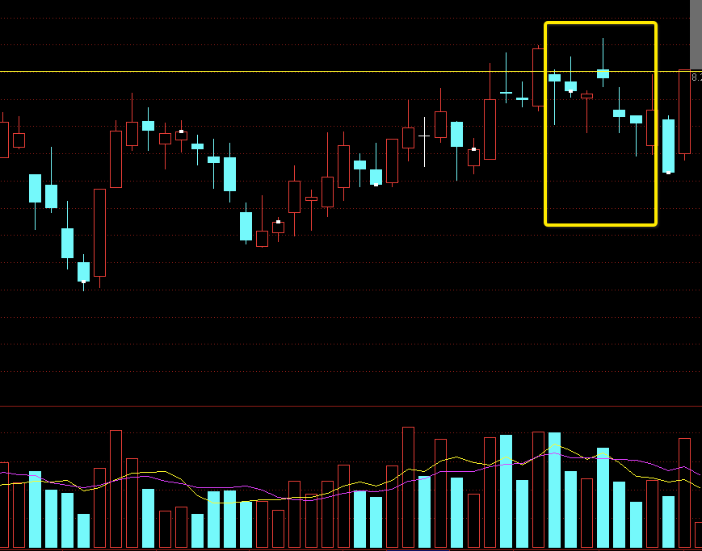
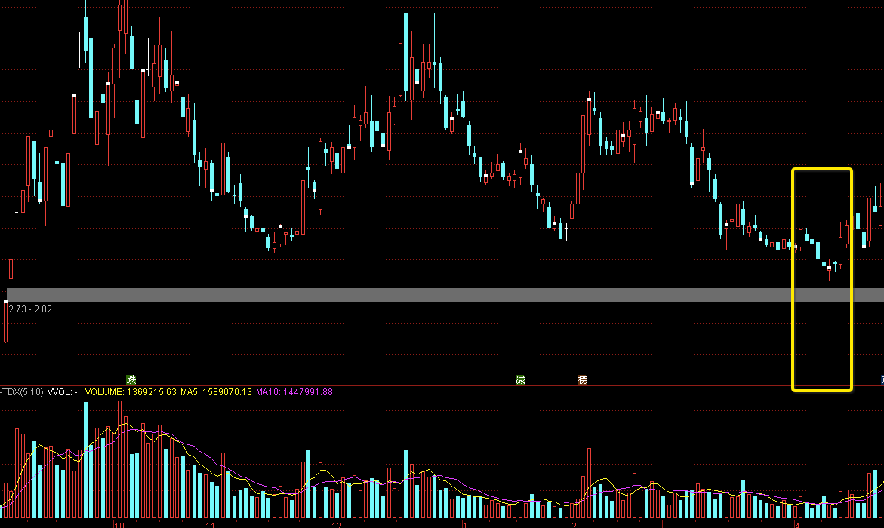

<h1>Plunge</h1>

<!-- **中文** |  [日文](./README.JP.md) -->

## 介绍

Plunge是通过识别图表的形态量价来选股的工具,主要用来参考学习,不作为投资依据

## 准备

- [Python](https://www.python.org/) - 行情数据采集使用python开发
- [Golang](https://go.dev/) - 识别图表使用Go语言开发
- [MariaDB](https://mariadb.org/) - 数据库使用MariaDB（也可以使用MySQL的其他分支）
- [tushare.pro](https://tushare.pro/) - 行情数据源

## 表结构 / desc dayline

      +-------------+------------------+------+-----+---------------------+----------------+
      | Field       | Type             | Null | Key | Default             | Extra          |

      +-------------+------------------+------+-----+---------------------+----------------+

      | id          | int(10) unsigned | NO   | PRI | NULL                | auto_increment |

      | date        | date             | NO   | MUL | NULL                |                |

      | code        | varchar(16)      | NO   | MUL | NULL                |                |

      | open        | double unsigned  | NO   |     | NULL                |                |

      | close       | double unsigned  | NO   |     | NULL                |                |

      | low         | double unsigned  | NO   |     | NULL                |                |

      | high        | double unsigned  | NO   |     | NULL                |                |

      | volume      | double unsigned  | NO   |     | NULL                |                |

      | pre_close   | double unsigned  | NO   |     | 0                   |                |

      | paused      | varchar(25)      | NO   |     | 0                   |                |

      | m5          | double unsigned  | NO   |     | 0                   |                |

      | m10         | double unsigned  | NO   |     | 0                   |                |

      | m20         | double unsigned  | NO   |     | 0                   |                |

      | m30         | double unsigned  | NO   |     | 0                   |                |

      | m60         | double unsigned  | NO   |     | 0                   |                |

      | create_time | timestamp        | YES  |     | current_timestamp() |                |

      +-------------+------------------+------+-----+---------------------+----------------+

## 安装和使用
- 获取代码  

      git clone https://github.com/Harvey-Specter/plunge.git
- 采集某天的数据并且计算那天的均线（计算均线需要历史数据，例如计算MA60需要60天的行情数据）

      cd plunge
      python savedate/tsdata.py 2022-07-01
- 编译&运行

      go build -o plunge
      chmod +x ./plunge && ./plunge dayline 2022-07-01

- 结果文件：执行完后生成的结果文件*.EBK可以直接通达信金融终端的自定义板块
      
## 识别的形态
下面的都是理想中的符合形态,实际挑选出来误差很大,可以根据喜好修改程序来收紧/放宽筛选规则

1.	**头肩底放量突破颈线**    
     

2.	**头肩底/箱体中轴以上放量启动**  
   

3.	**首板之后没跌下来并且出现吸筹形态**  
   

4.	**上升趋势中连续出现高/低开并且收星** 
   

5.	**缺口附近出现支持** 
   

## 许可
[MIT](./LICENSE)