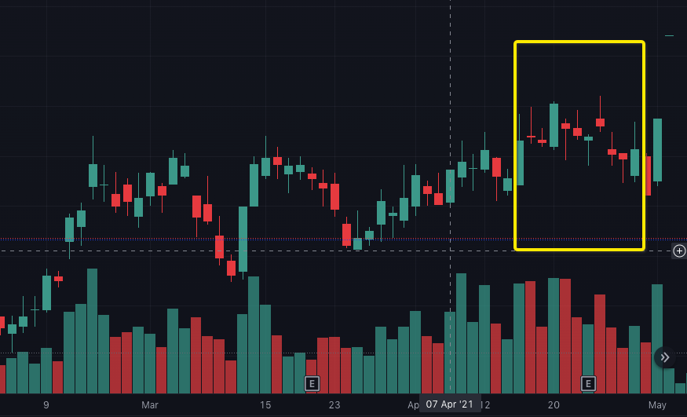

   

<h1>Plunge</h1>

<**日本語** |  [中文](./README_zh.md)>

## 導入

Plungeは、チャートの形状と出来高価格を特定して銘柄を選択するためのツールであり、投資の根拠としてではなく、主に参照と学習のために使用されます。

## 準備

- [Python](https://www.python.org/) - 市場データ収集はPythonを使用して開発されています
- [Golang](https://go.dev/) - グラフを認識するプログラムはGolangで開発されています
- [MariaDB](https://mariadb.org/) - データベースはMariaDBを使用（MySQLの他のフォークも使用可能）
- [Stooq](https://stooq.com/) - 引用データソース
- [PostgreSQL](https://www.postgresql.org/) - 結果は PostgreSQL に保存されます

## インストールして使用する
- コードを取得  

      git clone https://github.com/Harvey-Specter/plunge.git
- 特定の日のデータを収集し、その日の移動平均を計算します (移動平均を計算するには履歴データが必要です。たとえば、MA60 の計算には 60 日間の市場データが必要です)。 最初に Stooq の Web サイトからデータをダウンロードする必要があります。私は通常、load dataを使用してデータベースをインポートし、次のプログラムを実行して移動平均を計算します。

      ##fomat datefile
      cat 20220701_d | awk 'BEGIN{FS=","}$1~/\.JP$/' | awk 'BEGIN{FS=",";OFS=","}$3>20220616&&$4=="000000"{print $1,substr($3,0,4)"-"substr($3,5,2)"-"substr($3,7,2),$5,$6,$7,$8,$9}' |sort -u > 0701.txt

      LOAD DATA INFILE '/Users/yourname/0701.txt'  
      INTO TABLE dayline
      FIELDS TERMINATED BY ','
      (code, date, open, high, low,close, volume);
      
      cd plunge
      python savedate/stooqdata.py 2022-07-01
- コンパイル/実行

      go build -o plunge
      chmod +x ./plunge && ./plunge dayline 2022-07-01

- 結果ファイル: プログラムはデフォルトで作業ディレクトリに結果ファイルを生成し、結果データはPlungeサーバーに保存され、必要に応じて出力ファイル形式を変更することもできます
      
## 認識されたフォーム
以下はフォームに沿ったものです。実際の選択にはいくつかのエラーがあります。好みに応じてプログラムを変更して、フィルタリング ルールを強化/緩和できます。

1.	**頭と肩の底がネックラインを突き破る**    
     

2.	**頭と肩の底/ボックスの中心軸の上から重いボリュームを開始します**  
   

3.	**大上昇後は下落せず積み上げパターンで登場**  
   

4.	**上昇トレンドでの連続した高値/安値の始値と星の終値** 
   

5.	**ギャップ付近のサポート** 
   

## テーブル構造 /  dayline

      +-------------+------------------+------+-----+---------------------+----------------+
      | Field       | Type             | Null | Key | Default             | Extra          |

      +-------------+------------------+------+-----+---------------------+----------------+

      | id          | int(10) unsigned | NO   | PRI | NULL                | auto_increment |

      | date        | date             | NO   | MUL | NULL                |                |

      | code        | varchar(16)      | NO   | MUL | NULL                |                |

      | open        | double unsigned  | NO   |     | NULL                |                |

      | close       | double unsigned  | NO   |     | NULL                |                |

      | low         | double unsigned  | NO   |     | NULL                |                |

      | high        | double unsigned  | NO   |     | NULL                |                |

      | volume      | double unsigned  | NO   |     | NULL                |                |

      | pre_close   | double unsigned  | NO   |     | 0                   |                |

      | paused      | varchar(25)      | NO   |     | 0                   |                |

      | m5          | double unsigned  | NO   |     | 0                   |                |

      | m10         | double unsigned  | NO   |     | 0                   |                |

      | m20         | double unsigned  | NO   |     | 0                   |                |

      | m30         | double unsigned  | NO   |     | 0                   |                |

      | m60         | double unsigned  | NO   |     | 0                   |                |

      | create_time | timestamp        | YES  |     | current_timestamp() |                |

      +-------------+------------------+------+-----+---------------------+----------------+

